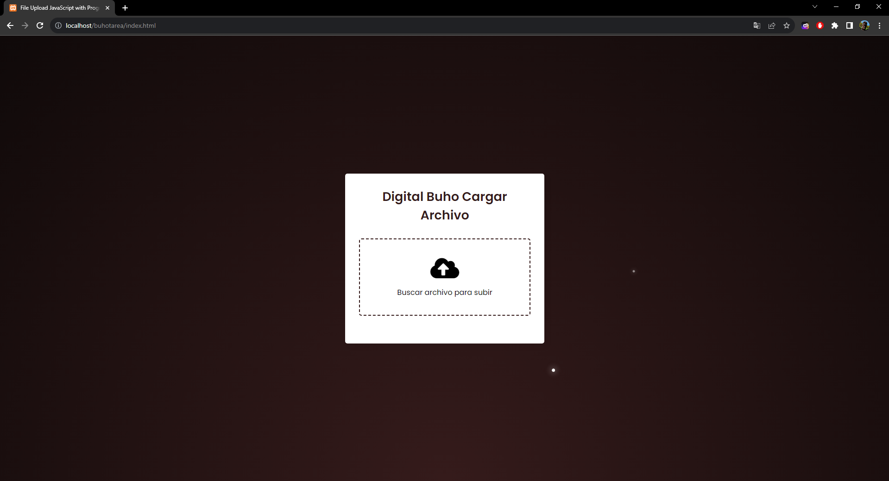
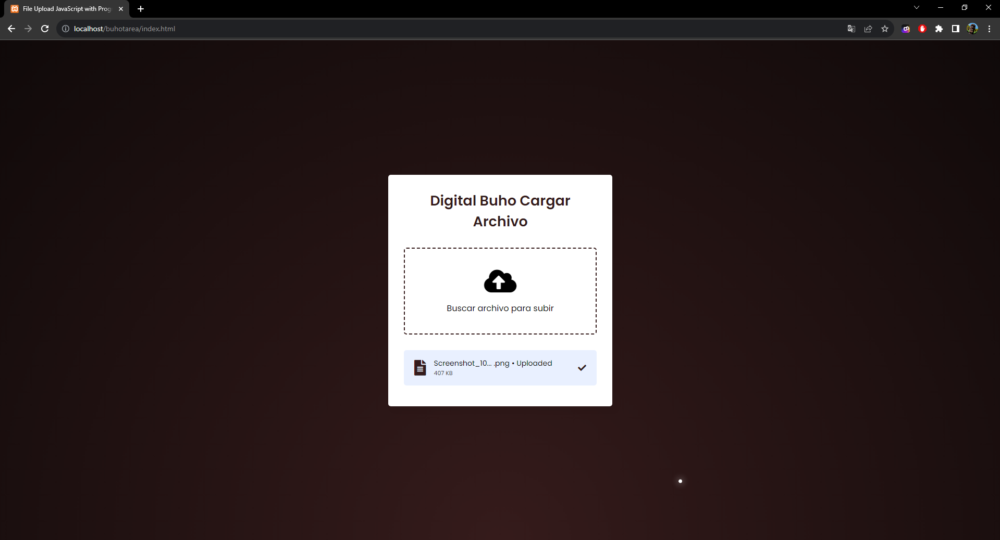

# Subir-Archivos-JavaScript
Trabajao realizado por:

Fabrizio Santiago Zuñiga Arivilca

Descripción del Proyecto:

Resolución del trabajo del poder subir archivos usando HTML, CSS, JavaScript y PHP

Requisitos previos: Para la creació de este proyecto se deben crear un archivo en HTML, CCS, JavaScript y PHP.

1.En el archivo HTML(Head) vinculamos las hojas de estilo que vamos a usar y otras dependencias necesarias:
   
    <head>
      <meta charset="UTF-8">
      <meta name="viewport" content="width=device-width, initial-scale=1.0">
      <title>File Upload JavaScript with Progress Ba</title>
      <link rel="stylesheet" href="style.css">
      <link rel="stylesheet" href="style2.css">
      <link rel="stylesheet" href="https://cdnjs.cloudflare.com/ajax/libs/font-awesome/5.15.3/css/all.min.css"/>
    </head>
    
2.En el body Creamos un div que contendra la subida de archivos con la barra de progreción y mostrar los archivos cargados recientemente:

      <body>  
        

          <header>Digital Buho Cargar Archivo</header>
          <form action="#">
            <input class="file-input" type="file" name="file" hidden>
            <i class="fas fa-cloud-upload-alt"></i>
            
Buscar archivo para subir

          </form>
          <section class="progress-area"></section>
          <section class="uploaded-area"></section>
        

        
      </body>
      </html>
      

3.En en archivo JS creamos una función que muestre la barra de carga y liste los archivo. A parte de redireccionar a un archivo php que se encargara de guiar los archivos a una carpeta para guardarlos:

      function uploadFile(name){
        let xhr = new XMLHttpRequest();
        xhr.open("POST", "php/upload.php");
        xhr.upload.addEventListener("progress", ({loaded, total}) =>{
          let fileLoaded = Math.floor((loaded / total) * 100);
          let fileTotal = Math.floor(total / 1000);
          let fileSize;
          (fileTotal < 1024) ? fileSize = fileTotal + " KB" : fileSize = (loaded / (1024*1024)).toFixed(2) + " MB";
          let progressHTML = `<li class="row">
                                <i class="fas fa-file-alt"></i>
                                

                                  

                                    ${name} • Uploading
                                    ${fileLoaded}%
                                  

                                  

                                    

                                  

                                

                              </li>`;
          uploadedArea.classList.add("onprogress");
          progressArea.innerHTML = progressHTML;
          if(loaded == total){
            progressArea.innerHTML = "";
            let uploadedHTML = `<li class="row">
                                  

                                    <i class="fas fa-file-alt"></i>
                                    

                                      ${name} • Uploaded
                                      ${fileSize}
                                    

                                  

                                  <i class="fas fa-check"></i>
                                </li>`;
            uploadedArea.classList.remove("onprogress");
            uploadedArea.insertAdjacentHTML("afterbegin", uploadedHTML);
              }
            });
            let data = new FormData(form);
            xhr.send(data);
          }
 4.En en archivo PHP los archivos cargados seran guardados en una carpeta de forma local llamada "files":
 
        <?php
          $file_name =  $_FILES['file']['name'];
          $tmp_name = $_FILES['file']['tmp_name'];
          $file_up_name = time().$file_name;
          move_uploaded_file($tmp_name, "files/".$file_up_name);
        ?>

   
